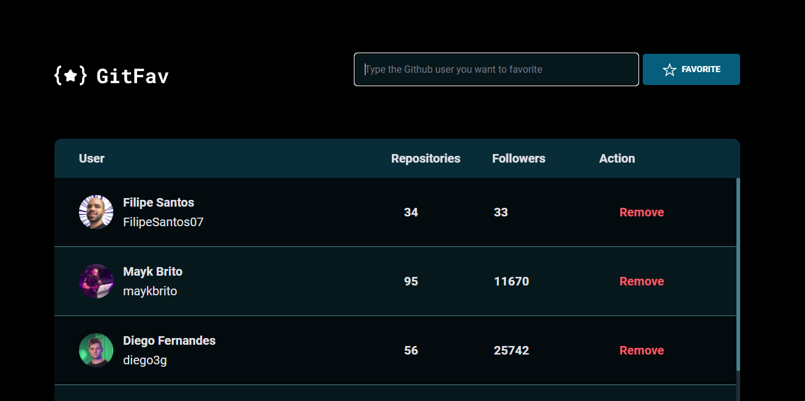

# Desafio GitFav

> Trilha Explorer

One more challenge successfully finished! 

Último desafio do Stage 6 - trilha Explorer da Rocketseat concluído com sucesso! Esse é o GitFav, nele você poderá favoritar usuários do Github e removê-los da lista. Nele a gente usou a API do Github para buscar as informações dos usuários. Nesse desafio foi abordado:

- Consumindo API do Github
- Aprendendo a criar uma classe Screen reader only
- Programação orientada a objetos (POO)
- Classes e heranças
- Criando HTML pelo JavaScript
- A importancia da imutabilidade
- Conhecendo o localStorage
- Métodos estáticos e promises
- Async Await promises
- Fluxo da aplicação com Try, Catch e Throw
- Criação de tabelas no HTML

And let's keep on moving forward!

[🔗 Clique aqui para acessar](https://filipesantos07.github.io/Desafio-GitFav-Stage-6/)

## 🛠️ Tecnologias

- HTML
- CSS
- JavaScript

## 💛 Contato

FilipeSantosEstudos1@gmail.com
